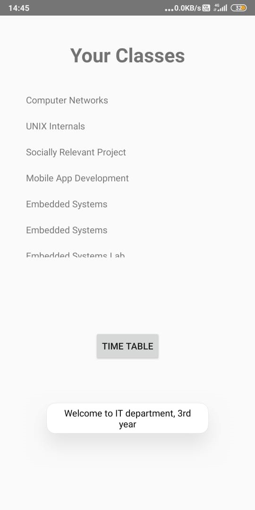
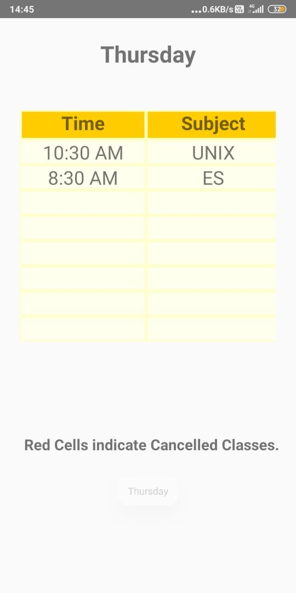
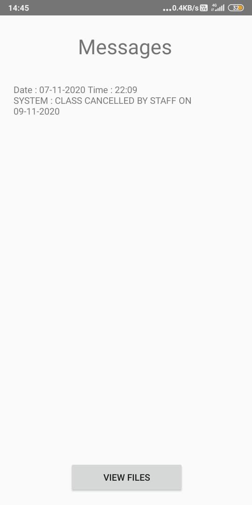
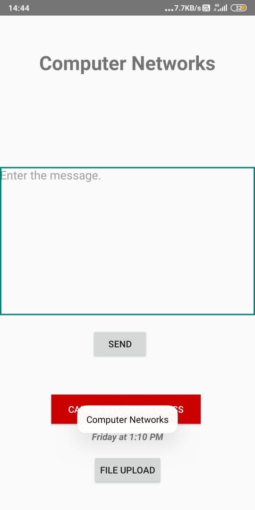

# Sparta_Android_Based_Student-Faculty_Document_Sharing_System
Android Mini Project

This project is an online portal between students and faculty. The application allows college faculty to share important data as well as notifications with students. It consists of a faculty login and student login. Faculty can upload documents like subject syllabus, timetable document, notifications, e-notes etc. through their provided login. The documents are uploaded by faculty to corresponding students registered. We built this application using FireBase DB which allows faculty to upload data and students may view, search and download required documents through their android device. Here students only see and download data of their particular semester. Rest data is hidden. Faculty may access and upload/edit documents to any semester or add any notice as desired.

Faculty may also cancel scheduled classes and the change will be reflected in the timetable of the student.

Screenshots -

